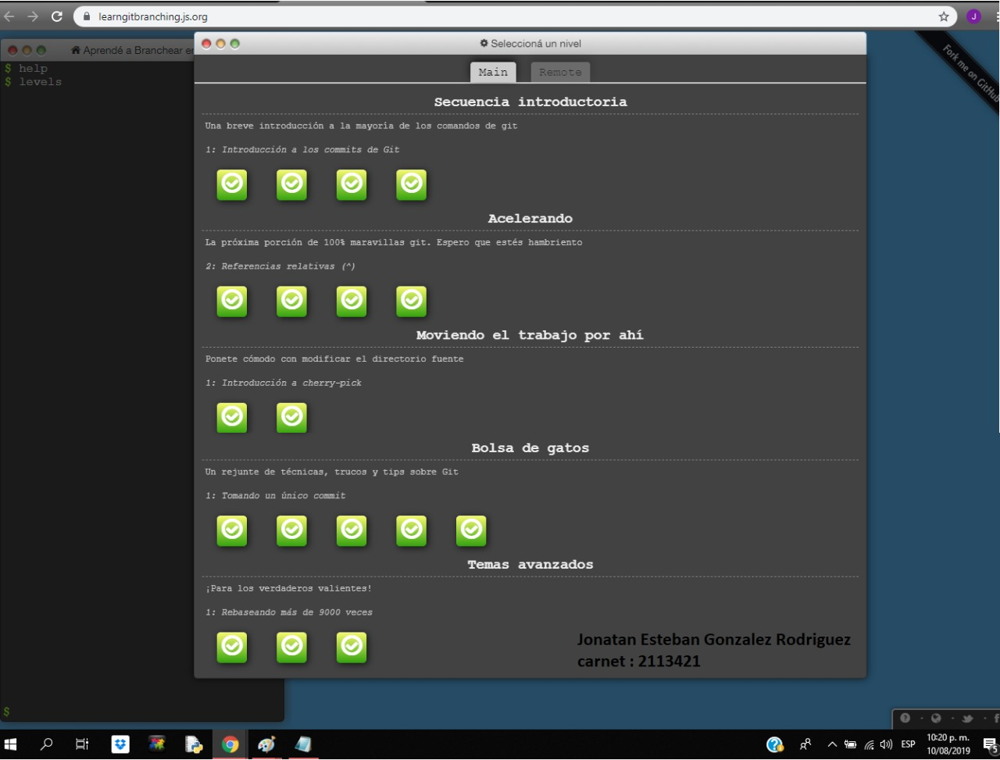
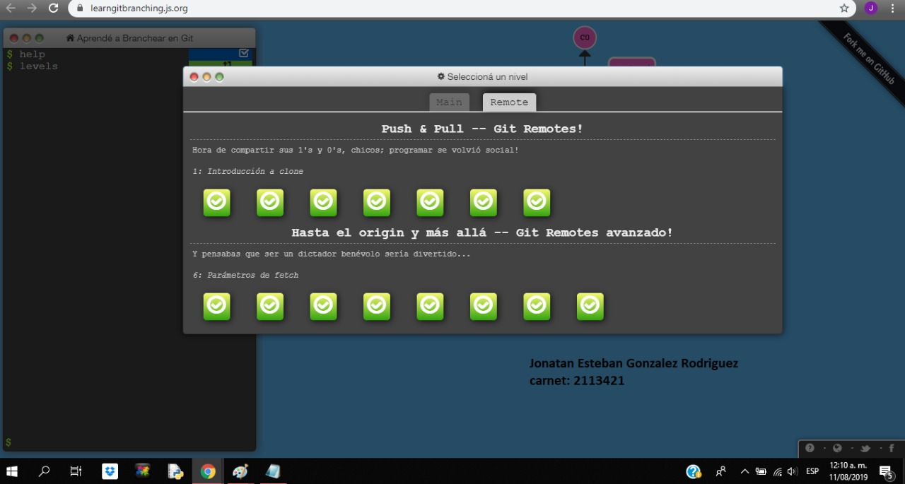

# Jonatan Esteban Gonzalez Rodriguez 
> Soy estudiante de Ingeniería de Sistemas en la [Escuela Colombiana de Ingeniería Julio Garavito](https://www.escuelaing.edu.co/es/), actualmente me encuentro cursando las siguientes asignaturas:
>
> * CVDS (Ciclos de Vida del Desarrollo de Software)
> * RECO (Redes de Computadores)
> * CAPM (Preparación para la Certificación Internacional CAPM)
> * CRTI (Creatividad, Tecnología e Innovación)

## Datos Personales
  _`Edad`_ **21 Años**
  
  _`Correo`_ **jonatan.gonzalez@mail.escuelaing.edu.co**
  
  _`Semestre`_ **Octavo**
  
  _`Plan de Estudios`_ **14**
  
  ### Hobbies
  1. Nadar
  2. Jugar Xbox
  3. Jugar futbol
  4. Ver partidos de futbol
  5. Comer helado
  6. Ir a cine
  7. Escuchar musica
  
  ### Mi equipo favorito  
  
  
  ## Learn Git Branching
  
  
  
  
